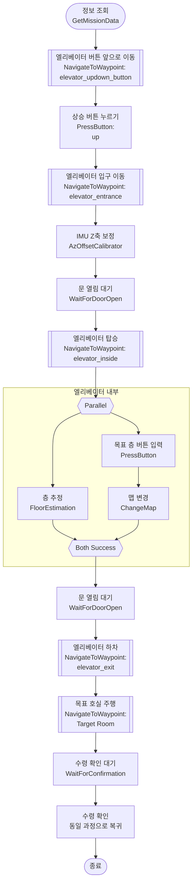

# Bero
[](https://documentation.ubuntu.com/release-notes/22.04/)
[](https://docs.ros.org/en/humble/index.html)
[](https://docs.python.org/3.10/)
[](https://cppreference.com/w/cpp/17.html)

[](https://github.com/ros-navigation/navigation2/tree/1.1.20)
[](https://github.com/SteveMacenski/slam_toolbox/tree/2.6.10)

Bero는 병원, 기숙사와 같이 외부인 출입이 제한되는 실내 다층 공간에서 배달을 수행하기 위한 프로젝트입니다.

3WD omni-wheel AMR을 통해 다음 기능을 수행합니다.

### **🚩 위치추정 및 자율주행**

- Behavior Tree 기반 다층 실내 자율주행
- SLAM Toolbox 기반 실내 지도 작성
- robot_localization 기반 wheel odometry와 IMU 센서 융합을 통한 odometry 추정
- AMCL 기반 scan matching을 통한 `map` frame 기준 위치 추정
- Nav2 기반 실내 자율주행

### **🖥️ 사용자 인터페이스**

- PyQt5 기반 GUI
- 목적지 입력, 목적지 정보, 수령 확인 표시 기능

### **👁️ 인지**

- YOLO 기반 엘리베이터 문 개폐 상태 인식 기능
- IMU 센서 기반 엘리베이터 상승·하강 감지 및 층 추정 파이프라인
- 엘리베이터 탑승, 하차, 층 추정 로직을 Behavior Tree와 연동

## 목차

- [Demo](#demo)
- [Flow](#flow)
- [Feature Details](#feature-details)
- [Maps](#maps)
- [Package Structure](#package-structure)
- [Build & Run](#build--run)
- [CI & Lint](#ci--lint)

## Demo

https://github.com/user-attachments/assets/35f18ad9-3357-4a4b-b1df-4f85fde25171

## Flow


## Feature Details

### 🖥️ PyQt5 User Interaction ([#33](https://github.com/shosae/Bero/pull/33))

PyQt5 기반 UI를 통해 사용자와 상호작용합니다.

- 도착지 호실 입력
 	- 호실 존재 여부 검증
- 배송 진행 상태 표시
- 도착 후 수령 확인 버튼
- 문제 발생 시 오류 출력

### 🌳 Behavior Tree-based Multi-floor Navigation ([#42](https://github.com/shosae/Bero/pull/42))

Nav2 Behavior Tree를 확장하여 엘리베이터를 이용하는 다층 이동 flow를 구성합니다.

- 엘리베이터를 이용하는 다층 이동 flow 구성
- UI, 문 개폐 탐지, 층 추정, 맵 변경 노드 등과 연동

<details>
<summary>Multi floor nav Flow</summary>



</details>

### 🛗 Door State Detection ([#39](https://github.com/shosae/Bero/pull/39))

YOLO26s 모델을 사용하여 엘리베이터의 개폐 여부를 인식합니다.

#### Training

- 다양한 조명 환경에서 엘리베이터 이미지 데이터 수집
- Roboflow를 활용하여 `opened`, `moving`, `closed` 상태 라벨링
- ±16% 밝기, 0.18% 픽셀 노이즈 데이터 증강

#### Inference

- YOLO model 학습 후 TensorRT engine 변환, 10Hz 추론 수행
- 8 프레임 이상 동일 상태가 유지될 때만 상태를 확정하여 순간적인 오판단 완화

### 📈 IMU-based Floor Estimation ([#41](https://github.com/shosae/Bero/pull/41))

IMU 센서의 Z축 가속도를 기반으로 엘리베이터 내부에서의 층수 변화를 추정합니다.

- IMU의 Z축 가속도 기반 엘리베이터 이동 구간 감지
- ZUPT 기반 수직 변위 추정
- 추정 변위를 기반으로 현재 층수 판별

### 🔄 Floor Estimation Pipeline


#### 1. Data Collection
- IMU 센서의 Z축 가속도 데이터 수집

#### 2. Preprocessing & Resampling
Raw IMU 데이터의 불규칙한 수신 간격을 고정 주기로 변환하고, noise와 outlier를 완화합니다.

- Median filter, clipping, Butterworth LPF 적용
- 이동 시작/정지 판단용 신호와 변위 계산용 신호를 목적별로 분리
- Resampling된 IMU 데이터를 다음 단계로 전달

#### 3. Segment Detection
이동 시작과 정지를 탐지하여 이동 구간(segment)을 확정합니다.

- 가속도 절댓값 기준으로 이동 시작 판단
- 가속도 절댓값과 표준편차 기준으로 정지 구간 판단
- 짧은 segment는 일시적인 흔들림으로 간주하여 제외

#### 4. Segment Integration
확정된 segment에 대해 가속도를 적분하여 수직 변위를 계산합니다.

- `sosfiltfilt` 기반 Butterworth LPF 적용
- ZUPT 기반 속도 drift 보정
- 보정된 속도를 적분하여 수직 변위 계산
- 변위가 작은 segment는 층 추정 대상에서 제외

#### 5. Floor Tracking
- 추정 변위와 층별 기준 높이를 비교하여 가장 가까운 층 선택
- 선택된 층 높이에 맞게 누적 변위 보정

이를 통해 마커나 별도의 외부 인식 모듈 없이 IMU만으로 층수 변화를 추정하도록 구성했습니다.

### Floor estimation Demo

https://github.com/user-attachments/assets/1c4ab710-95c1-437f-b88c-6418781a42e3

### 🗺️ Mapping & Navigation ([#48](https://github.com/shosae/Bero/pull/48), [#51](https://github.com/shosae/Bero/pull/51))

SLAM Toolbox와 Nav2를 사용하여 지도 작성 및 자율주행을 수행합니다.

- 사용 중인 버전을 기준으로 파라미터 튜닝
    - **Nav2**: `1.1.20`
    - **SLAM Toolbox**: `2.6.10`
- 로봇의 주행 특성과 사람이 많은 환경을 고려하여 navigation 파라미터를 튜닝

### Maps

➜: **Origin**`(x:0.0, y:0.0, yaw:0.0)`

<table width="850">
  <tr>
    <th align="center">Floor L</th>
  </tr>
  <tr>
    <td align="left">
      
    </td>
  </tr>

  <tr>
    <th align="center">Floor 2</th>
  </tr>
  <tr>
    <td align="left">
      
    </td>
  </tr>

  <tr>
    <th align="center">Upper Floor</th>
  </tr>
  <tr>
    <td align="left">
      
    </td>
  </tr>
</table>

### 📍 Localization ([#13](https://github.com/shosae/Bero/pull/13))

EKF로 `odom` 기준 odometry를 추정하고, AMCL로 `map` 기준 로봇 위치를 추정합니다.

#### Wheel Odometry

Encoder tick 변화량을 기반으로 각 바퀴의 회전 상태를 계산하고, 3WD omni-wheel 기구학을 통해 속도를 추정합니다.

- Encoder count 변화량을 각 바퀴의 position과 velocity로 변환
- 계산된 wheel state를 `/joint_states`로 발행
- 각 바퀴의 속도를 3WD omni-wheel 기구학에 적용하여 로봇 기준 `vx`, `vy`, `vyaw` 계산
- 계산된 속도를 적분하여 wheel odometry 발행

#### EKF Fusion

EKF에는 wheel odometry와 IMU를 역할에 따라 분리하여 사용합니다.

- Encoder 기반 wheel odometry의 `vx`, `vy` 사용
- IMU data의 `angular_velocity.z`를 `vyaw`로 사용
- Wheel odometry의 `vyaw`는 slip 영향이 크다고 보고 fusion에서 제외

#### AMCL

AMCL을 통해 LiDAR scan과 map을 비교하여 `map` frame 기준의 위치를 추정합니다.

- EKF에서 추정한 `/odometry/filtered`를 motion update에 사용
- `nav2_amcl::OmniMotionModel` 사용
- `likelihood_field` laser model 사용

## Package Structure

```
Bero/
├── src/
│   ├── bero_bringup/              # bringup
│   ├── bero_description/          # URDF, robot_state_publisher 구성
│   │   └── urdf/                      # URDF file
│   ├── bero_drivers/
│   │   ├── camera/                # camera node
│   │   ├── encoder/               # joint state publisher
│   │   ├── imu/                   # IMU publisher node
│   │   │   └── config/                # IMU covariance Params
│   │   └── rplidar/               # RPLiDAR submodule
│   ├── bero_localization/         # wheel odometry node 및 EKF 기반 odometry 추정
│   │   └── config/                    # Wheel Odometry covariance, EKF Params
│   ├── bero_mapping/              # SLAM Toolbox 기반 mapping
│   │   └── config/                    # SLAM Toolbox Params
│   ├── bero_navigation/           # Nav2 기반 navigation
│   │   ├── config/                    # Nav2 Params
│   │   └── maps/                      # Map files
│   ├── bero_multi_floor_nav/      # 다층 이동 mission manager 및 BT nodes
│   │   ├── behavior_trees/            # Multi floor navigation XML files
│   │   └── config/                    # waypoints
│   ├── bero_perception_imu/       # IMU 기반 층수 추정
│   │   └── config/                    # 층 추정 파라미터
│   ├── bero_perception_vision/    # YOLO 기반 문 열림 탐지
│   │   └── models/                    # YOLO models
│   ├── bero_teleop/               # /cmd_vel 기반 모터 제어 node
│   ├── bero_ui/                   # PyQt5 기반 UI
│   ├── bero_ui_nav/               # UI 연동 단층 navigation
│   └── bero_msgs/                 # Custom msg, srv, action
└── .github/workflows/             # GitHub Actions CI
```

## Build & Run

### Build

```bash
cd ~
git clone --recursive https://github.com/shosae/Bero

cd ~/Bero
rosdep install --from-paths src --ignore-src -r -y

colcon build --symlink-install
source install/setup.bash
```

### Run

```bash
ros2 launch bero_bringup bero_bringup.launch.py             # Bringup 실행
ros2 launch bero_mapping mapping.launch.py                  # SLAM Toolbox 기반 지도 작성
ros2 launch bero_navigation navigation.launch.py            # Nav2 기반 단층 자율주행
ros2 launch bero_multi_floor_nav multi_floor_nav.launch.py  # 엘리베이터 연동 다층 자율주행
ros2 launch bero_multi_floor_nav multi_floor_nav.launch.py use_mock:=true # Behavior tree Mock 테스트(인지 노드 및 하드웨어 제어 mock)
```

## CI & Lint

GitHub Actions를 사용하여 빌드 및 테스트를 수행합니다.

### CI

CI는 ROS2 Humble Docker container에서 실행됩니다.

- submodule을 포함한 repository checkout
- `rosdep` 기반 의존성 설치
- `colcon build`를 통한 workspace build
- `colcon test`를 통한 lint 및 test 실행
- `colcon test-result --verbose`를 통한 테스트 결과 확인

### Lint

ROS2의 ament lint tools를 사용해 lint 검사를 수행합니다.

**Python**

- `ament_flake8`
- `ament_pep257`
- `ament_copyright`

**C++**

- `ament_cpplint`
- `ament_flake8`
- `ament_uncrustify`
- `MAX_LINE_LENGTH 110`
